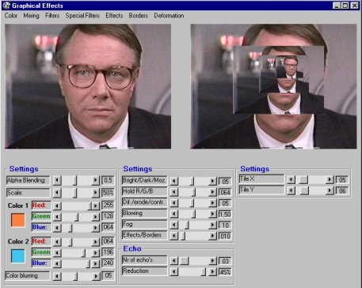



## Advanced graphics

### Description

Fore those who are interested: 84 functions to manipulate a picture. To speed things up, GetPixel and Setpixel is used. Note that not all functions can be manipulated in the program, but it is just to show you how things are done... Anyway, all functions (in fact they are just mods, 'cause they have no return) can be found in the module. The manipulations go from "normal" (like emboss) to very complexe deformations. Only for the advanced! See screenshot.
 
### More Info
 

             |
---                |---
**Submitted On**   |2001-07-14 19:23:22
**By**             |[stephane swertvaegher](https://github.com/Planet-Source-Code/PSCIndex/blob/master/ByAuthor/stephane-swertvaegher.md)
**Level**          |Advanced
**User Rating**    |4.9 (59 globes from 12 users)
**Compatibility**  |VB 6\.0
**Category**       |[Complete Applications](https://github.com/Planet-Source-Code/PSCIndex/blob/master/ByCategory/complete-applications__1-27.md)
**World**          |[Visual Basic](https://github.com/Planet-Source-Code/PSCIndex/blob/master/ByWorld/visual-basic.md)
**Archive File**   |[Advanced g264969152001\.zip](https://github.com/Planet-Source-Code/stephane-swertvaegher-advanced-graphics__1-27273/archive/master.zip)

